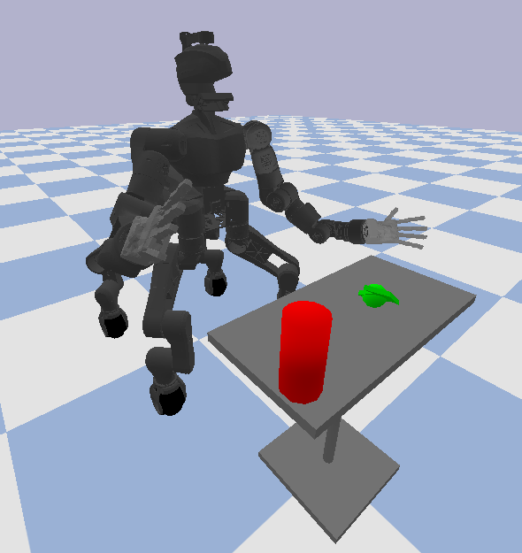
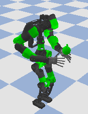
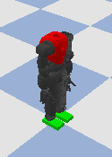
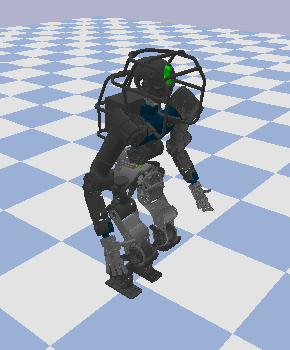
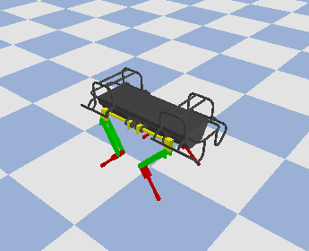
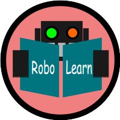

# Robolearn Environments

"A Python package with OpenAI-Gym-like environments for Robot Learning"

<table align="center">
    <tr>
    <td style="width:150px; height:150px; background-color:red;text-align:center; vertical-align:middle">
    
    </td>
    <td style="width:150px; height:150px; background-color:red;text-align:center; vertical-align:middle">
    
    </td>
    <td style="width:150px; height:150px; background-color:red;text-align:center; vertical-align:middle">
    
    </td>
    <td style="width:150px; height:150px; background-color:red;text-align:center; vertical-align:middle">
    
    </td>
    <td style="width:150px; height:150px; background-color:red;text-align:center; vertical-align:middle">
    
    </td>
    </tr>
</table>

**This package is still private** so for granting access to it please contact me.

**Robolearn** is a python package that defines common interfaces
between robot learning algorithms and robots. More info in the following
[link](https://github.com/domingoesteban/robolearn).

<p align="center">

</p>


# Environments
| Robot | Task | Gym Name  |
| ------------ |:------:|:-------:|
|  |  |   |
| Centauro | Reaching | CentauroReachingEnv-v0  |
| Centauro | Locomotion | CentauroLocomotionEnv-v0  |
|  |  |   |
| Cogimon | Reaching | CogimonReachingEnv-v0  |
| Cogimon | Locomotion | CogimonLocomotionEnv-v0  |
|  |  |   |
| Walkman | Reaching | WalkmanReachingEnv-v0  |
| Walkman | Locomotion | WalkmanLocomotionEnv-v0  |
|  |  |   |
| Coman | Locomotion | ComanLocomotionEnv-v0  |
|  |  |   |
| Hyq | Locomotion | HyqLocomotionEnv-v0  |

# Installation

```bash
git clone https://github.com/domingoesteban/robolearn_envs
cd robolearn_envs
pip install -e .
```

# Example
Standard-OpenAI-Gym way:
```python
import gym
import robolearn_envs

# A 'headless' version of the same environment would be:
# env = gym.make('RoboLearn-CogimonLocomotion-v0')
env = gym.make('RoboLearn-CogimonLocomotionRender-v0')

# By default, Robolearn Bullet environments starts rendering when they are reset.
obs = env.reset()

for _ in range(500):
    obs, reward, done, info = env.step(env.action_space.sample())

env.close()
```

Easy-to-customize way:
```python
from robolearn_envs.pybullet import CogimonLocomotionEnv

env = CogimonLocomotionEnv(
    active_joints='WB',
    control_mode='joint_torque',
    is_render=True,
    sim_timestep=0.001,
    frame_skip=10,
    seed=1510,
    max_time=None,
)

# If is_render=True, rendering starts when the environment is reset.
obs = env.reset()

for _ in range(100):
    obs, reward, done, info = env.step(env.action_space.sample())

env.close()
```

# Citation
If this repository was useful for your research, we would appreciate that you can cite it:

    @misc{robolearn-envs,
      author = {Esteban, Domingo},
      title = {RoboLearn Environments},
      year = {2018},
      publisher = {GitHub},
      journal = {GitHub repository},
      howpublished = {\url{https://github.com/domingoesteban/robolearn_envs}},
    }

# Acknowledgements
- *Erwin Coumans* for Bullet, PyBullet, and his didactic examples 
([Bullet repository](https://github.com/bulletphysics/bullet3))
- *Enrico Mingo* for
[Coman](https://github.com/ADVRHumanoids/iit-coman-ros-pkg),
[Walkman](https://github.com/ADVRHumanoids/iit-walkman-ros-pkg), and
[Cogimon](https://github.com/ADVRHumanoids/iit-cogimon-ros-pkg)
urdf models.
- *Malgorzata Kamedula* for
[Centauro](https://github.com/ADVRHumanoids/centauro-simulator/tree/master/centauro_gazebo)
urdf model.
